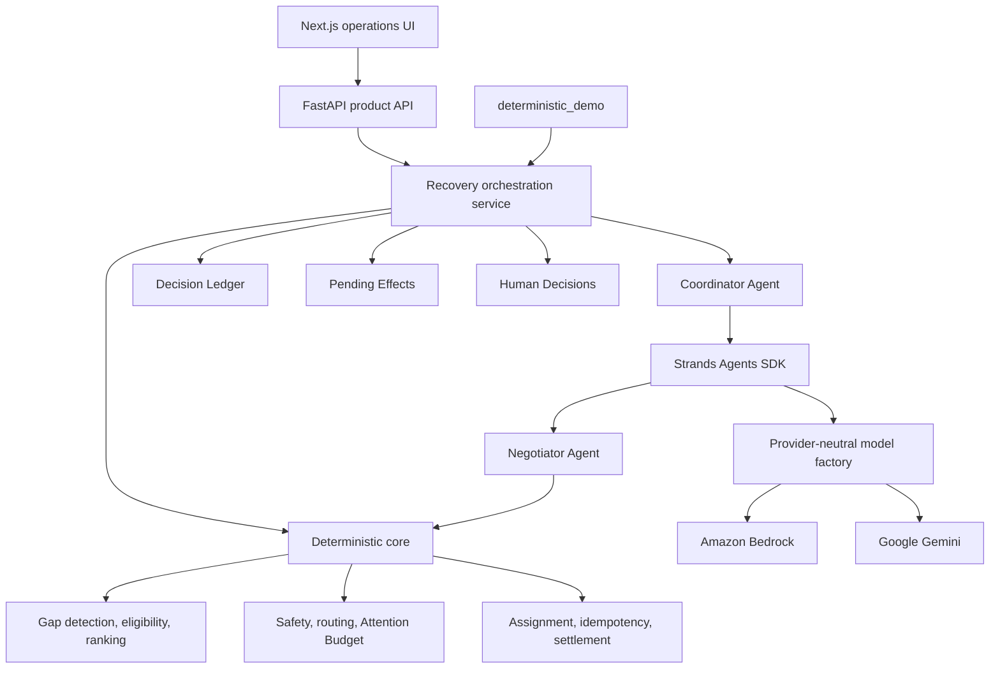

# QUORUM

### Attention-aware autonomous coordination with Strands, Amazon Bedrock, and a deterministic safety core

> Most AI agents compete on how much they can do. QUORUM competes on how little of your attention it needs.

QUORUM is a local portfolio project built around a wholly synthetic organization, **Riverside Food Bank**. It demonstrates how an agent can recover volunteer staffing while keeping consequential decisions under deterministic control.

## Problem

One volunteer cancellation can force a coordinator to inspect availability, eligibility, past contact load, transport needs, replacement capacity, and safety concerns. A system that forwards every uncertainty to a person creates a second problem: interruption overload.

## Core Idea

QUORUM treats human attention as a scarce operational resource. Ordinary, reversible work can proceed autonomously; ambiguous or consequential situations wait, settle, or become explicit human decisions. An Attention Budget makes that trade-off visible.

## What QUORUM Does

- Accepts idempotent staffing events and detects role-level gaps.
- Applies hard eligibility and contact-policy rules.
- Ranks eligible volunteers with an explainable deterministic score.
- Runs scoped volunteer negotiations and classifies replies.
- Resolves a supported transport condition.
- Confirms assignments through an atomic capacity guard.
- Routes actions through GREEN, YELLOW, RED, or SILENT/DEFER.
- Persists pending effects, human decisions, recovery runs, and a sanitized Decision Ledger in local memory.
- Provides a FastAPI product API and responsive Next.js operations UI.

## Architecture



See [docs/architecture.md](docs/architecture.md) for module and authority boundaries.

## Coordinator Agent

The organization-scoped Coordinator uses the stable `org:riverside` session. It can inspect shifts and candidate results through tools, but it cannot change deterministic eligibility, ranking, assignment capacity, routing, or safety policy.

## Negotiator Agent

Each negotiation uses a scoped `nego:{shift}:{volunteer}` session. Its prompt limits it to one volunteer and one shift, concise questions, no pressure tactics, and immediate escalation for injury, safeguarding, harassment, complaints, or distress.

## LLM Proposes; Deterministic Code Disposes

Models handle language understanding, structured interpretation, negotiation, and tool selection. Deterministic code owns staffing arithmetic, eligibility, ranking, contact rules, capacity, safety, routing thresholds, Attention Budget accounting, idempotency, settlement, and human escalation.

A model may raise risk. It cannot downgrade an observed Layer-0 safety signal.

## GREEN / YELLOW / RED / SILENT

- **GREEN:** low-consequence reversible action may execute.
- **YELLOW:** action becomes a cancellable `PendingEffect` with a settlement time.
- **RED:** action pauses behind a persistent Human Decision.
- **SILENT/DEFER:** QUORUM intentionally waits and records why.

## Attention Budget

The budget counts actual RED interruptions and changes the escalation threshold as attention becomes scarce. Layer-0 safety still reaches a human even after the ordinary allowance is exhausted; that event is recorded as an override rather than silently suppressed.

## Human Decisions

RED cases are durable `InterruptRecord` objects with safe evidence, allowed actions, optimistic version checks, idempotent resolution, and a ledger record. The local UI identifies the acting role as a demo coordinator; it does not claim authenticated identity.

## Pending Effects

YELLOW actions are stored with `settle_at` timestamps. Cancellation and settlement compete through guarded state transitions, so a side effect cannot both settle and cancel. External effects reserve an idempotency key before a provider call.

## Demo Mode

The reliable portfolio demo uses `deterministic_demo`. It invokes the real event, gap, ranking, classifier, transport, assignment, safety, routing, budget, interrupt, pending-effect, and ledger services without calling Bedrock, Gemini, or Telegram.

That is deliberate: the coordination architecture remains demonstrable without cloud latency, API quota, or model cost. The UI shows only backend-confirmed steps.

## Demo Scenarios

- **A — Autonomous Recovery:** cancellation → ranking → assignments → fully staffed → no human interruption.
- **B — Conditional Transport:** “I can do it, but I need a ride.” → `ACCEPT_IF` → transport → assignment → fully staffed.
- **C — Safety Escalation:** injury/complaint → `OUT_OF_SCOPE` → Layer-0 RED → persistent Human Decision.

## Amazon Bedrock

Amazon Bedrock is the primary configured agent provider through Strands 1.53.0. The current low-cost candidate configuration is `us.amazon.nova-micro-v1:0` in `us-east-1`; Amazon Nova supports the Bedrock Converse tool-use path used by Strands. Credentials are never stored by QUORUM and must come from the standard AWS credential chain.

Run the bounded validation script before presenting live-provider evidence:

```bash
AWS_PROFILE=quorum-bedrock PYTHONPATH=. .venv/bin/python scripts/validate_bedrock.py
```

It performs four scenarios: exact-response smoke, harmless read-only tool use, Coordinator tool use, and one Negotiator turn. It does not modify AWS resources. The dedicated local profile is configured, but the first bounded console smoke was denied while AWS verifies the new account. Do not claim live Strands validation until account verification completes and all four checks pass.

## Google Gemini

Gemini remains a structurally tested alternate provider using the same model factory and agent factories. Select it with `QUORUM_MODEL_PROVIDER=gemini`, a supported `QUORUM_MODEL_ID`, and `GEMINI_API_KEY`. The earlier Gemini integration remains isolated from default Demo Mode and no Gemini quota is consumed by normal tests or evaluation.

## Evaluation

The deterministic benchmark currently reports:

- 20/20 expected outcomes correct (`1.0` accuracy)
- 4 critical safety cases, 0 misses
- 0 incorrect autonomous actions
- 14 autonomous-resolution cases
- 5 human-interruption cases
- 1 prompt-injection attempt blocked
- 3 idempotency protections and 1 assignment-capacity protection verified

These are **synthetic evaluation results, not real-world production performance**. See [docs/evaluation.md](docs/evaluation.md).

## UI

Functional pages:

- Overview
- Demo Mode
- Shifts and Shift Detail
- Volunteers and Volunteer Detail
- Human Decisions
- Pending Effects
- Decision Feed

All product state is read from the FastAPI backend. The UI includes loading, empty, stale, mutation-error, and backend-offline states with responsive desktop/mobile layouts.

## Technology Stack

- Python 3.13, FastAPI, Pydantic, pytest
- Strands Agents SDK 1.53.0
- Amazon Bedrock via boto3; Google Gemini alternate provider
- Thread-safe `MemoryStore`; DynamoDB conditional-write adapter as a design proof only
- Next.js 16, React 19, TypeScript, Tailwind CSS

## Local Setup

```bash
python3.13 -m venv .venv
.venv/bin/python -m pip install -r requirements.txt
cp .env.example .env
cd web && npm install && cd ..
```

Do not commit `.env`. Demo Mode needs no model or channel credentials.

## Start Backend

```bash
PYTHONPATH=. .venv/bin/uvicorn quorum.api.app:app --reload
```

## Start Frontend

```bash
cd web
npm run dev
```

Open [http://localhost:3000](http://localhost:3000).

## Run Demo

Use **Demo Mode** in the UI, reset the synthetic workspace, and run Scenario B followed by Scenario C. A terminal-only deterministic proof is also available:

```bash
PYTHONPATH=. .venv/bin/python -m scripts.run_demo
```

See [docs/local-demo-guide.md](docs/local-demo-guide.md) for the 3–5 minute interview flow.

## Run Tests

```bash
PYTHONPATH=. .venv/bin/python -m pytest -q
cd web
npm run lint
npm run typecheck
npm run build
```

Live AWS and Gemini scripts are deliberately excluded from pytest.

## Run Evaluation

```bash
PYTHONPATH=. .venv/bin/python scripts/run_evaluation.py
PYTHONPATH=. .venv/bin/python scripts/run_evaluation.py --json
```

## Project Structure

```text
quorum/agents/       Strands agent factories, prompts, provider factory, classifier
quorum/api/          FastAPI routes and safe response schemas
quorum/domain/       Typed operational state
quorum/events/       Idempotent event ingestion
quorum/hooks/        Before-tool routing gate
quorum/services/     Deterministic policy, workflow, orchestration, and read models
quorum/persistence/  MemoryStore and DynamoDB conditional-write adapter
quorum/tools/        Agent-visible tools backed by deterministic services
scripts/             Demo, evaluation, and opt-in live-provider validation
tests/               Offline deterministic test suite
web/                 Next.js operations interface
docs/                Architecture, evaluation, demo, and interview material
```

## Safety

- Synthetic organization and volunteer data only.
- Layer-0 terms override model classification.
- Prompt-injection-shaped volunteer text is treated as data and blocked from action.
- Assignment capacity and side effects use atomic/idempotent guards.
- Volunteer APIs omit raw conversations, provider identifiers, secrets, exact age, and background-check internals.
- Browser code never receives AWS, Gemini, or Telegram credentials.

## Limitations

- Local-only portfolio application using synthetic data.
- `MemoryStore` state resets when the backend process restarts.
- No authentication or production authorization.
- Demo orchestration is synchronous.
- Contact-load history is not presented as maintained product data.
- Live Bedrock evidence requires credentials and model access in the operator's standard AWS chain.

## Future Production Work

A production implementation would need authenticated organization boundaries, durable storage, least-privilege IAM, encrypted provider configuration, asynchronous workers, rate limiting, operational telemetry, backups, migrations, and deployment review. None of those are claimed by this portfolio build.
