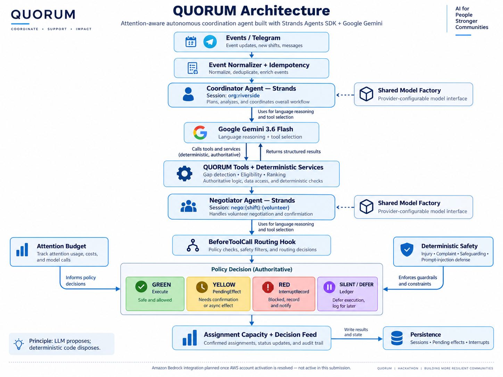

# QUORUM

### Attention-aware autonomous coordination agent built with Strands Agents SDK + Google Gemini

> **Most AI agents compete on how much they can do. QUORUM competes on how little of your attention it needs.**

Built for the **AWS Agents for Humans Hackathon — Good Neighbor Agents Track**.

---

## The Problem

Small community organizations often depend on volunteers to keep essential operations running.

A single volunteer cancellation can trigger a surprisingly large amount of coordination:

- Who is eligible to replace them?
- Who is available?
- Who has already been contacted too often?
- Can a volunteer help only under certain conditions?
- Does the coordinator actually need to be interrupted?
- Is the situation safe enough for an AI system to handle autonomously?

Traditional systems either leave all of this work to a human coordinator or notify the coordinator about every small issue.

QUORUM takes a different approach.

It treats **human attention as a scarce resource**.

---

## What is QUORUM?

QUORUM is an autonomous volunteer-coordination agent for community organizations.

It can:

- detect staffing gaps,
- identify eligible volunteers,
- rank candidates deterministically,
- contact and negotiate with volunteers,
- understand conditional responses,
- resolve ordinary blockers,
- update assignments,
- keep an auditable decision trail,
- and interrupt the human coordinator only when genuine judgment is required.

A coordinator can operate with an **Attention Budget**, such as:

> "I only want to be interrupted twice this week unless something is genuinely critical."

QUORUM must then ration its right to interrupt.

---

## Core Principle

### LLM proposes; deterministic code disposes.

Google Gemini is used for:

- language understanding,
- reply interpretation,
- negotiation,
- structured classification,
- and tool selection.

Deterministic application code remains authoritative for:

- staffing arithmetic,
- eligibility,
- volunteer ranking,
- assignment capacity,
- contact limits,
- age and background-check policies,
- quiet hours,
- safety overrides,
- routing thresholds,
- idempotency,
- Attention Budget accounting,
- settlement state transitions,
- and human interrupts.

The model can raise a safety concern.

It cannot lower one.

---

## Architecture



QUORUM uses two persistent Strands agent roles:

### Coordinator Agent

Responsible for organization-level coordination.

Example session:

```text
org:riverside# QUORUM

QUORUM is an attention-aware autonomous roster-recovery agent for the synthetic **Riverside Food Bank**. It uses the Strands Agents SDK with Google Gemini as the active model provider. Strands remains provider-agnostic; QUORUM's agent architecture and deterministic authority do not change with the model provider.

Implemented:

- separate Strands Coordinator and per-thread Negotiator agents
- real Gemini-backed inference and Strands tool calling
- persisted organization and nego:{shift}:{volunteer} sessions
- durable interrupt/resume proof
- deterministic gap detection, eligibility, candidate ranking, and assignment capacity
- BeforeToolCallEvent routing across GREEN, YELLOW, RED, and SILENT/DEFER
- Attention Budget, cancellable PendingEffect settlement, stable idempotency, and decision ledger
- deterministic safety overrides that model output cannot downgrade
- FastAPI backend and provider-neutral Telegram channel
- synthetic dataset, three deterministic scenarios, and a fail-closed live agent demo

Amazon Bedrock was the originally intended provider but could not be live-validated because AWS account activation remained blocked during the hackathon. Bedrock and the DynamoDB adapter remain future deployment paths, not completed submission infrastructure. AgentCore, EventBridge, a dashboard, and production IAM are not claimed.

## Setup

~~~bash
python3.13 -m venv .venv
.venv/bin/python -m pip install -r requirements.txt
cp .env.example .env
~~~

Set these values in the ignored .env:

~~~dotenv
GEMINI_API_KEY=your-local-secret
QUORUM_MODEL_PROVIDER=gemini
QUORUM_MODEL_ID=gemini-3.6-flash
~~~

Never commit .env. gemini-2.5-flash returned a provider 404 for this account because it is unavailable to new users; gemini-3.6-flash is the API-verified replacement. QUORUM uses minimal thinking and short output budgets for predictable operational turns.

## Run

~~~bash
# Inspect the synthetic fixture
PYTHONPATH=. .venv/bin/python -m scripts.seed_demo

# Run the three deterministic authority/safety scenarios
PYTHONPATH=. .venv/bin/python -m scripts.run_demo

# Run real Gemini Coordinator, Negotiator, tools, classifications, E2E, and RED safety proof
PYTHONPATH=. .venv/bin/python -m scripts.run_agent_demo

# Start the API
PYTHONPATH=. .venv/bin/uvicorn quorum.api.app:app --reload

# Run the full suite, including Phase 0 durability
PYTHONPATH=. .venv/bin/python -m pytest tests spikes/interrupt_durability/test_spike.py -v
~~~

The live demo prints only synthetic observable state. It includes a 55-second pause between phases so it fits Gemini free-tier request windows. It fails instead of simulating success when Gemini, tool calls, classifications, resolution, or safety evidence is missing.

API endpoints:

- GET /health
- GET /shifts
- POST /events/cancel
- POST /events/no-show
- POST /events/tick
- POST /webhooks/messages
- GET /interrupts
- POST /interrupts/{id}/resolve
- GET /feed
- POST /pending/{id}/cancel

## Telegram

The existing adapter has real inbound and outbound validation. These commands use TelegramChannel and never print credentials or message contents:

~~~bash
PYTHONPATH=. .venv/bin/python -m scripts.send_test_message
PYTHONPATH=. .venv/bin/python -m scripts.poll_telegram
~~~

The isolated smoke command sends exactly QUORUM Gemini integration ready; run it at most once after the Gemini demo passes.

## Submission material

See [architecture](docs/architecture.md), [four-minute demo script](docs/demo-script.md), and [Devpost draft](docs/devpost-submission.md).
