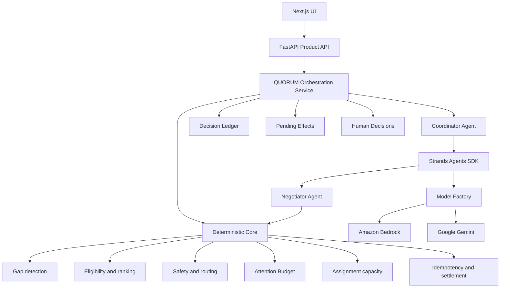

# QUORUM Architecture

QUORUM separates probabilistic language work from deterministic operational authority. It is a local portfolio system over synthetic Riverside Food Bank data, not a deployed cloud service.



## Request path

1. The Next.js UI calls typed FastAPI endpoints through one API client.
2. The API delegates Demo Mode runs to `DemoOrchestrationService`.
3. The orchestrator composes existing services; it does not reimplement their rules.
4. Deterministic services own events, gap arithmetic, eligibility, ranking, reply safety precedence, transport, capacity, routing, budget, settlement, and interrupts.
5. Recovery-run steps and product read models expose only backend-confirmed safe state.
6. Decision Ledger, Pending Effects, and Human Decisions make consequences observable.

## Model boundary

`quorum.agents.models.create_model` is the only provider-construction boundary. Both agent factories and the optional model-backed classifier receive the generic Strands `Model` interface.

- **Amazon Bedrock:** `BedrockModel` receives region, model/inference-profile ID, temperature zero, and bounded output. boto3 resolves credentials through its standard chain; QUORUM never accepts or logs AWS secret values.
- **Google Gemini:** `GeminiModel` receives its key only in memory through `client_args`, a supported model ID, temperature zero, minimal thinking, and bounded output.

The default configured Bedrock candidate is `us.amazon.nova-micro-v1:0` in `us-east-1`. It is inexpensive, text-focused, and supports the Converse tool-use flow. The current machine had no standard-chain credentials, so repository documentation does not misrepresent an unperformed live check. `scripts/validate_bedrock.py` is the bounded proof when credentials are available.

## Agent roles

### Coordinator

- Session: `org:riverside`
- Scope: organization-level recovery planning and tool selection
- Inputs: synthetic event/shift context and deterministic tool results
- Cannot: invent candidates or override policy, capacity, safety, or routing

### Negotiator

- Session: `nego:{shift}:{volunteer}`
- Scope: one volunteer and one shift
- Inputs: synthetic volunteer replies and approved tool results
- Cannot: pressure volunteers, reveal other volunteer data, reopen a decline, or handle Layer-0 safety autonomously

Two roles keep organization planning separate from a narrowly scoped conversation history. They still share one model factory and one deterministic authority layer.

## Deterministic core

“LLM proposes; deterministic code disposes” means model output is advisory until code validates it.

- `GapDetector` calculates role shortfalls from required capacity and confirmed assignments.
- `CandidateRanker` rejects ineligible volunteers, then computes an explainable weighted score.
- `PolicyGuard` enforces background checks, minimum driver age, contact caps, concurrent asks, quiet hours, and final declines.
- `ReplyClassifier` has deterministic precedence for safety, prompt injection, known intents, and canonical transport conditions.
- `MemoryStore.confirm_assignment` atomically prevents duplicate or over-capacity assignments.
- `EscalationEngine` applies Layer-0 safety and named EV thresholds against the shared Attention Budget.
- `PendingEffectService` guards settlement/cancellation state changes.
- `InterruptService` persists and resolves RED decisions idempotently.

## Routing

- **GREEN:** execute a low-consequence reversible action.
- **YELLOW:** persist a cancellable settlement window.
- **RED:** persist an interrupt and require a human decision.
- **SILENT/DEFER:** take no action and record intentional waiting.

Layer-0 includes injury, medical, safeguarding, harassment, discrimination, complaint, service allocation, permanent removal, money/employment, and unsafe-minor concerns. It bypasses the heuristic and cannot be downgraded by a model.

## Attention Budget

`EscalationEngine` reads and spends the same `budget:riverside` record used by the API and Demo Mode. Repeating one decision cannot spend twice. Ordinary thresholds rise as budget is consumed; Layer-0/critical situations remain visible through a recorded override if allowance is exhausted.

## Persistence, concurrency, and settlement

`MemoryStore` is protected by one re-entrant lock and returns copies at its boundaries. It provides atomic event/effect idempotency, capacity confirmation, pending transitions, interrupt claims, budget spending, and recovery-run keys.

The DynamoDB adapter demonstrates equivalent conditional-write expressions but is not wired as production persistence. Strands `FileSessionManager` persists local agent session state. Neither is a claim of deployment.

## Synthetic Demo

`deterministic_demo` exercises the real backend services without a model provider or external channel:

```text
Synthetic event
  → gap detection
  → eligibility and ranking
  → local pending-effect settlement
  → deterministic reply classification
  → transport when required
  → assignment capacity guard or Layer-0 interrupt
  → gap re-evaluation
  → recovery timeline and Decision Ledger
```

Scenario A and B finish autonomously. Scenario C stops at a real persistent Human Decision. This is not a mocked UI; only the language-model dependency is intentionally absent from the reliable demo path.

## Product API and UI

FastAPI exposes safe schemas for Overview, Shifts, Volunteers, Pending Effects, Human Decisions, Decision Feed, Demo scenarios, reset, and recovery runs. Next.js renders those resources without recomputing policy or inventing metrics. Polling is used only for live read views; synchronous demo runs do not invent an asynchronous protocol.

## External boundaries

- Demo Mode never invokes Bedrock, Gemini, or Telegram.
- Telegram delivery exists only behind explicit non-demo configuration and idempotency gates.
- Live provider validation is opt-in and excluded from pytest.
- No credentials are returned by an API or bundled into the frontend.

## Failure behavior

- Provider/model configuration fails closed.
- Demo exceptions persist a truthful `FAILED` run with a safe summary.
- Offline frontend views show an API-unavailable state.
- Pending handler failures become `FAILED`, not successful effects.
- Interrupted workflows stay visible until explicitly resolved.

## Deliberate scope

No authentication, production database, hosted deployment, EventBridge, Lambda, ECS, AgentCore, RAG, vector database, multi-tenancy, WebSockets, or production monitoring stack is implemented.
